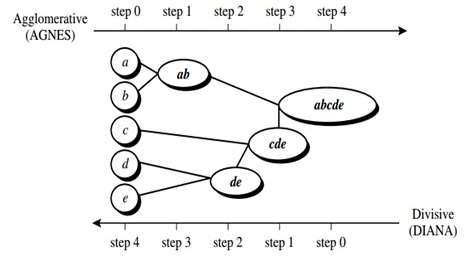

# Clustering

Clustering merupakan salah satu metode yang termasuk kedalam unsupervised learning. Clustering bertujuan untuk melakukan pengelompokan pada suatu set data yang memiliki kemiripan berdasarkan jarak terdekatnya. Clustering memiliki karakteristik dimana anggota dalam satu cluster memiliki kemiripan yang sama atau jarak yang sangat dekat, namun anggota antar cluster memiliki kemiripan yang sangat berbeda atau jarak yang sangat jauh. 

Menurut Tan,PN dalam bukunya yang berjudul *Introduction to Data Mining*, metode clustering dibagi menjadi dua jenis, yaitu hierarchical clustering dan partitional clustering[^1]. Dalam hierarchical clustering melakukan pengelompokan data dengan menggunakan suatu diagram dendrogram dimana setiap data terdekat akan dijadikan menjadi satu kelompok hingga menjadi satu kelompok besar. Beberapa metode dalam hierarchical clustering yaitu single linkage, comple linkage, average linkage, dan ward's minimum variance.

Sedangkan partitional clustering yaitu proses pengelompokan data dimana setiap cluster memiliki titik pusat cluster (centroid) dan mencoba menghitung setiap data yang paling dekat dengan centroid tersebut. Metode dalam partitional clustering yaitu k-means, fuzzy k-means, dan mixture modelling.

# Hierarchical Clustering

Secara umum, dalam hierarchical clustering dibagi menjadi dua jenis yaitu *agglomerative* dan *divisive*[^2]. Kedua metode ini dibedakan berdasarkan cara dalam melakukan pengelompokkannya dalam bentuk bagan hirarki, menggunakan bottom-up atau top-down manner.

1. **Agglomerative clustering** 

Agglomerative clustering biasa disebut juga sebagai agglomerative nesting (AGNES) dimana cara kerja dalam melakukan pengelompokan hirarki menggunakan bottom-up manner. Prosesnya setiap data akan disebut sebagai 1 cluster kecil (leaf) yang hanya memiliki 1 anggota saja, lalu pada tahap selanjutnya dua cluster yang memiliki kemiripan akan dikelompokkan menjadi 1 cluster yang lebih besar (nodes). Proses ini akan dilakukan terus menerus hingga semua data menjadi satu cluster besar (root). 

2. **Divisive hierarchical clustering**

Divisive hierarchical clustering biasa disebut juga sebagai divisive analysis (DIANA) dimana cara kerja dalam mengelompokkan data menggunakan top-down manner. Prosesnya suatu data akan dianggap menjadi satu cluster besar (root), lalu dalam setiap iterasinya setiap data yang memiliki karakteristik yang berbeda akan dipecah menjadi 2 cluster yang lebih kecil (nodes) dan proses akan terus berjalan hingga setiap data menjadi 1 cluster kecil (leaf) yang hanya memiliki 1 anggota saja.

Berikut ini perbedaan cara kerja agglomerative dan divisive clustering bekerja.

Tujuan dari clustering sendiri baik hierarchical maupun partitional clustering yaitu untuk membuat cluster yang memiliki karakteristik yang sama dalam satu anggota cluster namun memiliki karakteristik yang cukup berbeda antar clusternya. Konsep inilah yang mengharuskan dalam membuat cluster dalam memperhatikan (dis)similarity antar clusternya. Untuk menghitung tingkat (dis)similarity antar anggota cluster yaitu dengan melakukan perhitungan jarak (euclidean distance, manhattan, dst). 

Dalam hierarchical clustering karena proses dalam membuat cluster yaitu dengan membandingkan antar 2 observasi cluster. Proses perhitungan (dis)similarity pada hierarchical clustering biasanya menggunakan linkage method. Berikut ini beberapa jenis linkage method yang sering digunakan:

1. **Complete Linkage** / **Maximum Linkage**
2. **Single Linkage** / **Minimum Linkage**
3. **Average Linkage**
4. **Centroid Linkage**
5. **Ward's minimum Variance**

 
# Reference

[^1]: Tan, P.N., Steinbach, M., Kumar, V. (2006) Introduction to Data Mining. Boston:Pearson Education.
[^2]: [Hierarchical Clustering](https://uc-r.github.io/hc_clustering)

