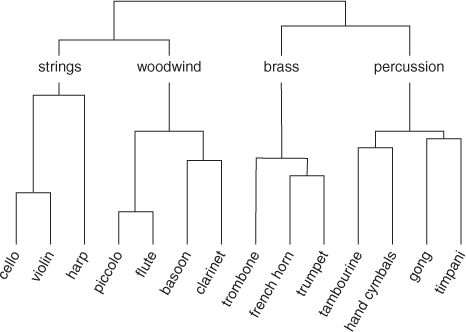

<style>

body {
text-align: justify}

</style>

```{r setup, include=FALSE}
knitr::opts_chunk$set(echo = TRUE, 
                      warning = FALSE, 
                      message = FALSE, 
                      fig.align = "center")
options(scipen = 99)
library(dplyr)
```

# Clustering

Clustering merupakan salah satu metode yang termasuk kedalam unsupervised learning. Clustering bertujuan untuk melakukan pengelompokan pada suatu set data yang memiliki kemiripan berdasarkan jarak terdekatnya. Clustering memiliki karakteristik dimana anggota dalam satu cluster memiliki kemiripan yang sama atau jarak yang sangat dekat, namun anggota antar cluster memiliki kemiripan yang sangat berbeda atau jarak yang sangat jauh. Menurut (Tan et al., 2006) dalam bukunya yang berjudul *Introduction to Data Mining*, metode clustering dibagi menjadi dua jenis, yaitu Hierarchical Clustering dan Partitional Clustering[^1]. 

**Partitional Clustering** umumnya bertujuan untuk mengelompokkan data menjadi beberapa cluster yang lebih kecil[^2]. Pada prosesnya, setiap cluster akan memiliki titik pusat cluster (centroid) dan mencoba menghitung setiap data yang paling dekat dengan centroid tersebut. Metode dalam partitional clustering diantaranya k-means, fuzzy k-means, dan mixture modelling.

```{r echo=FALSE}
knitr::include_graphics("image/partitional.png")
```

Sedangkan dalam **Hierarchical Clustering**, pengelompokan data dilakukan dengan membuat suatu bagan hirarki (**dendrogram**) dengan tujuan menunjukkan kemiripan antar data[^2]. Setiap data yang mirip akan memiliki hubungan hirarkis yang dekat, dan dendrogram terus terbentuk hingga dihasilkan satu kelompok besar. Cluster dapat dihasilkan dengan memotong struktur hirarkis pada level tertentu. Beberapa metode dalam hierarchical clustering yaitu single linkage, complete linkage, average linkage, dan ward's minimum variance.

```{r echo=FALSE}
knitr::include_graphics("image/hc.png")
```
Pada kesempatan kali ini kita akan mendalami terkait Hierarchical Clustering serta aplikasinya untuk pengolahan data.

# Hierarchical Clustering

Secara umum, hierarchical clustering dibagi menjadi dua jenis yaitu *agglomerative* dan *divisive*[^3]. Kedua metode ini dibedakan berdasarkan cara dalam melakukan pengelompokan data hingga membentuk bagan hirarki (dendrogram), menggunakan bottom-up atau top-down manner.

1. **Agglomerative clustering** 

Agglomerative clustering biasa disebut juga sebagai agglomerative nesting (AGNES) dimana cara kerja dalam melakukan pengelompokan hirarki menggunakan **bottom-up manner**. Prosesnya dimulai dengan menganggap setiap data sebagai 1 cluster kecil (leaf) yang hanya memiliki 1 anggota saja, lalu pada tahap selanjutnya dua cluster yang memiliki kemiripan akan dikelompokkan menjadi 1 cluster yang lebih besar (nodes). Proses ini akan dilakukan terus menerus hingga semua data menjadi satu cluster besar (root). 

2. **Divisive hierarchical clustering**

Divisive hierarchical clustering biasa disebut juga sebagai divisive analysis (DIANA) dimana cara kerja dalam mengelompokkan data menggunakan **top-down manner**. Prosesnya dimulai dengan menganggap satu set data sebagai satu cluster besar (root), lalu dalam setiap iterasinya setiap data yang memiliki karakteristik yang berbeda akan dipecah menjadi 2 cluster yang lebih kecil (nodes) dan proses akan terus berjalan hingga setiap data menjadi 1 cluster kecil (leaf) yang hanya memiliki 1 anggota saja.

Berikut ini perbedaan cara kerja agglomerative dan divisive clustering bekerja.

```{r echo=FALSE}
knitr::include_graphics("image/agnes-vs-diana.png")
```

Selain memahami proses pembuatan dendrogramnya, mari coba memahami bagaimana node-node (tiap cluster) terbuat dan digabungkan.

Tujuan dari clustering secara umum, baik hierarchical maupun partitional clustering adalah untuk membuat cluster yang memiliki karakteristik yang sama dalam satu anggota cluster dan memiliki karakteristik yang berbeda antar clusternya. Konsep inilah yang mengharuskan proses pembuatan cluster untuk memperhatikan **(dis)similarity** / ukuran ketidakmiripan antar clusternya. 

Tingkat (dis)similarity antar anggota cluster dapat direpresentasikan dengan **jarak** (atau beberapa menyebutnya **distance matrix**). Terdapat beragam pilihan distance matrix yang pemakaiannya bergantung pada tipe data/topik analisis yang sedang digunakan (euclidean distance, manhattan, dst)[^3].

## (Dis)similarity Measure

Hal yang penting dilakukan pertama kali saat ingin melakukan analisis clustering yaitu melakukan perhitungan (dis)similarity. Pemilihan metode (dis)similarity akan menentukan seberapa mirip suatu data untuk dijadikan kedalam satu cluster. Dalam metode clustering AGNES, (dis)similarity ini digunakan untuk membentuk distance matrix. Pengukuran (dis)similarity yang biasa digunakan adalah *euclidean distance* dan *manhattan distance*, namun bisa saja menggunakan pengukuran jarak yang lain, bergantung pada data yang sedang kita analisis. Berikut ini formula dalam perhitungan (dis)similarity dari kedua metode tersebut:

1. *Euclidean distance*

$$d_{xy} = \sqrt {\sum_{i=1}^{n}(x_i - y_i)^2}$$

2. *Manhattan distance*

$$d_{xy} = \sum_{i=1}^{n} |{(x_i - y_i)}|$$

Ada beberapa pengukuran (dis)similarity yang lain yang bisa digunakan yaitu menggunakan *correlation-based distance*. Correlation-based distance biasa digunakan ketika kita ingin mengetahui bentuk (dis)similarity pada suatu data yang bergerak "naik" atau "turun" secara bersamaan. Pengukuran (dis)similarity ini sering digunakan untuk melakukan analisis ekspresi gen atau dalam dunia marketing, ketika kita ingin melakukan customer segmentation berdasarkan kesamaan barang yang dibeli oleh pelanggan tanpa memperhatikan banyak barang yang mereka beli. 

Euclidean distance dan manhattan distance cenderung memiliki konsep yang berkebalikan dengan correlation-based distance, data yang akan dikelompokkan bersama merupakan data yang memiliki karakteristik nilai yang sama, entah sama besarnya atau sama kecilnya. Pengukuran ini biasa digunakan pada kasus customer segmentation yang memperhatikan banyaknya pembelian dari pelanggan, segmentasi daerah yang memiliki kasus COVID tinggi/rendah, dan lain sebagainya[^5]. Pada R, untuk menghitung (dis)similarity bisa menggunakan fungsi `dist()`. Secara default, fungsi `dist()` akan menghitung euclidean distance antar observasi. 

Dalam hierarchical clustering, selain menghitung (dis)similarity antar observasi, diperlukan juga cara untuk menghitung (dis)similarity antar 2 cluster observasi sehingga dapat terbentuk dendrogram dari cluster-cluster yang ada. Proses penggabungan cluster-cluster kecil menjadi satu dendrogram utuh dilakukan menggunakan **linkage method**. Berikut ini beberapa jenis linkage method yang sering digunakan:

1. **Complete Linkage** / **Maximum Linkage**
2. **Single Linkage** / **Minimum Linkage**
3. **Average Linkage**
4. **Centroid Linkage**
5. **Ward's minimum Variance**

## Complete/Maximum Linkage

Pengukuran (dis)similarity atau jarak antar cluster dilakukan dengan mengukur terlebih dahulu jarak antar tiap observasi dari cluster yang berbeda (**pairwise distances**). Kemudian, jarak paling tinggi (maximum distance) akan menjadi ukuran (dis)similarity antar cluster. Hal ini membuat dendrogram yang terbentuk menjadi lebih terpisah antar clusternya (terbentuk cluster yang "compact").

Berikut formula jarak antar cluster menggunakan complete linkage:

$$d_{12} = \max_{ij} d(X_i, Y_j)$$

di mana:

* $X_1, X_2, ..., X_k$ : observasi pada cluster 1
* $Y_1, Y_2, ..., Y_k$ : observasi pada cluster 2
* $d(X, Y)$ : jarak antara data pada cluster 1 dengan data pada cluster 2

## Single/Minimum Linkage

Pengukuran (dis)similarity atau jarak antar cluster dilakukan dengan mengukur terlebih dahulu jarak antar tiap observasi dari cluster yang berbeda pairwise distances. Kemudian, jarak paling kecil (minimum distance) akan menjadi ukuran (dis)similarity antar cluster. Hal ini membuat dendrogram yang terbentuk menjadi lebih "loose" atau berdekatan antar clusternya.

Berikut formula jarak antar cluster menggunakan single linkage:

$$d_{12} = \min_{ij} d(X_i, Y_j)$$


## Average Linkage

Pengukuran (dis)similarity atau jarak antar cluster dilakukan dengan mengukur terlebih dahulu jarak antar tiap observasi dari cluster yang berbeda pairwise distances. Kemudian, dihitung rata-rata jarak dari pairwise distance tersebut dan nilai tersebut akan menjadi ukuran (dis)similarity antar cluster. Umumnya akan menghasilkan rupa cluster antara "loose" dan "compact".

Berikut formula jarak antar cluster menggunakan average linkage:

$$d_{12} = \frac{1}{kl} \sum_{i=1}^{k}\sum_{j=1}^{l} d(X_i, Y_j)$$

## Centroid Linkage

Perhitungan (dis)similarity atau jarak antar cluster dilakukan dengan mengukur jarak antar centroid pada dua cluster. Perhitungan centroid disini menggunakan rata-rata pada suatu variabel x. Dendrogram yang akan terbentuk adalah berdasarkan cluster yang memiliki jarak centroid paling kecil.

Berikut formula jarak antar cluster menggunakan centroid linkage:

$$d_{12} = d(\bar X, \bar Y)$$

## Ward's Minimum Variance

Perhitungan (dis)similarity atau jarak antar cluster dengan meminimalkan nilai variansi total within-cluster. Setiap cluster yang memiliki jarak minimum antar clusternya akan digabungkan menjadi satu menjadi sebuah dendrogram.

Berikut adalah ilustrasi untuk kelima jenis linkage di atas[^4]:

```{r echo=FALSE, fig.width="150%"}
knitr::include_graphics("image/linkage.png")
```

# Hierarchical Clustering Application

Keunggulan dari hierarchical clustering yang tidak dimiliki oleh metode clustering lain adalah dapat membuat dendrogram yang merepresentasikan kedekatan antar data. Hal ini amat bermanfaat khususnya dalam analisis network/komunitas atau deteksi data dari suatu komunitas. Oleh karena itu hierarchical clustering banyak dilakukan pada kasus-kasus berikut:

1. [Social Network Community Detection](https://www.hindawi.com/journals/complexity/2017/3719428/)
2. [Analisis Evolusi Mahluk Hidup - Biodiversity of Butterflies](https://www.floridamuseum.ufl.edu/science/at-last-butterflies-get-a-bigger-better-evolutionary-tree/)
3. [Analisis Penyebaran Penyakit - Nextrain for COVID19 Tracking](https://academic.oup.com/bioinformatics/article/34/23/4121/5001388)

# Additional Notes

## What to Tune?

Kasus yang berbeda akan menggunakan beberapa setting yang berbeda dalam pembuatan hierarchical clustering. Berikut adalah hal-hal yang dapat dipertimbangkan dalam pembuatan hierarchical clustering:

* Distance Matrix apa yang sebaiknya digunakan?

Hal ini amat bergantung pada data yang kita olah. Bacaan lebih lanjut tentang beragam tipe distance matrix untuk tiap tipe data dapat dilihat [disini](https://people.revoledu.com/kardi/tutorial/Similarity/index.html).

* Linkage Method apa yang sebaiknya digunakan?

Linkage method akan menentukan rupa dendrogram yang terbentuk. Telah dilakukan diskusi terkait beragam linkage method dan pemilihannya [disini](https://stats.stackexchange.com/questions/195446/choosing-the-right-linkage-method-for-hierarchical-clustering) .

## Pros & Cons

Sebelum menggunakan hierarchical clustering, ada baiknya untuk mempertimbangkan beberapa kelebihan dan kekurangannya.

Kelebihan:

* Mampu menggambarkan kedekatan antar data dengan dendrogram.
* Cukup mudah untuk pembuatannya.
* Dapat menentukan banyak cluster yang terbentuk setelah dendrogram terbentuk.

Kekurangan:

* Tidak dapat menganalisis data kategorik secara langsung (terhambat pada penghitungan jarak yang hanya bisa dilakukan untuk data numerik, sehingga data kategorik perlu dipre-process terlebih dahulu).
* Tidak diperuntukkan untuk menghasilkan jumlah cluster optimal yang mutlak (jumlah cluster dapat berubah-ubah tergantung level pemotongan dendrogram).
* Sensitif terhadap data yang memiliki skala berbeda (sehingga data perlu dinormalisasi/standarisasi terlebih dahulu).
* Sensitif terhadap outlier.
* Cukup berat komputasinya untuk data berukuran besar.

# Dendrogram & Interpretation

Setelah menghasilkan dendrogram dari hierarchical clustering, sudah sepatutnya kita perlu mampu membaca dendrogram tersebut. Sebagai contoh, berikut adalah gambar kedekatan beberapa instrumen musik yang digambarkan dengan dendrogram:

```{r echo=FALSE}

```

Dendrogram sejatinya merupakan struktur yang menggambarkan kemiripan antar data. Tiap data kita pada awalnya diletakan di suatu level dasar dimana tiap data berdiri sendiri sebagai satu cluster tunggal. Pada contoh di atas, tiap instrumen musik merupakan 1 cluster tunggal di bagian dasar dendrogram. 

Kemudian, 2 data yang berdekatan akan dihubungkan dengan suatu garis yang bersatu di titik tertentu sehingga menjadi cluster yang lebih besar. Contohnya cluster instrumen "piccolo" & "flute" dan cluster instrumen "basoon" & "clarinet". 

Panjang garis antar data (dihitung tegak lurus dari titik data hingga titik kedua garis bersatu) mewakilkan nilai (dis)similarity antar data (umumnya berupa nilai distance matrix yang dipakai). Disini kita bisa menyimpulkan bahwa "piccolo" dengan "flute" memiliki kedekatan yang lebih tinggi dibandingkan "basoon" dengan "clarinet". Kita juga bisa mengetahui bahwa "flute" memiliki kedekatan yang lebih tinggi dengan "clarinet" dibandingkan dengan "trumpet". Hal ini karena "flute" dan "clarinet" memiliki panjang garis antar data yang lebih pendek dibandingkan antara "flute" dan "trumpet".

Pada dendrogram, kita juga tetap dapat melakukan partisi antar data atau membuat cluster-cluster data dengan memotong dendrogram di nilai distance / (dis)similarity tertentu. Pada contoh ini kita membuat partisi berupa cluster "strings", "woodwind", "brass", dan "percussion".

Layaknya menentukan kedekatan antar data, kita juga dapat menetukan kedekatan antar cluster dengan memperhitungkan panjang garis antar data. Dari dendrogram di atas kita bisa menarik insight bahwa cluster "woodwind" lebih dekat dengan cluster "strings" dibandingkan dengan cluster "brass" dan "percussion".

Bila disimpulkan, semakin panjang garis antar data maka semakin berbeda antar data/cluster tersebut, dan semakin pendek garis antar data maka semakin mirip antar data/cluster tersebut. Dari pemahaman ini, kita bisa menentukan manakah data yang berdekatan/berjauhan dengan data yang sedang kita analisis.


# Cluster Analysis

Meskipun kita tidak diwajibkan untuk menentukan nilai `k` (jumlah cluster yang ingin dibentuk), terdapat beberapa hal yang perlu diperhatikan dari cluster-cluster yang terbentuk pada dendrogram. 

Seperti yang diketahui bahwa agglomerative clustering bekerja dengan konsep "bottom-up" yang mana artinya setiap data akan menjadi cluster-cluster dan setiap cluster kecil yang memiliki kesamaan akan digabungkan menjadi satu cluster hingga seluruh data menjadi satu cluster besar. Dalam analisis cluster, akan sangat mungkin kita memperoleh cluster yang hanya memiliki satu atau sedikit anggota saja sehingga menyebabkan banyaknya cluster yang terbentuk. Ketika hal tersebut terjadi, kita perlu melakukan pengecekan kembali pada data yang kita miliki. Hal ini bisa disebabkan karena adanya data yang cukup berbeda dengan yang lainnya atau bisa disebut sebagai outlier / anomali. Data yang seperti ini akan menyebabkan adanya cluster yang memiliki satu anggota.

Berikut ini adalah langkah yang dilakukan untuk melakukan cluster analisis:

1. Menyiapkan data dimana data yang digunakan adalah data bertipe numerik
2. Menghitung (dis)similarity atau jarak antar data yang berpasangan pada dataset untuk digunakan sebagai distance matrix
3. Membuat cluster dendrogram menggunakan beberapa metode linkage
4. Menentukan dimana akan melakukan pemotongan cluster tree. Disinilah tahap dimana banyak cluster akan terbentuk.


## Cluster Modeling

Pada artikel ini, akan dicoba dijelaskan cara kerja metode clustering AGNES menggunakan data `USArrest`. Sebelum membuat pemodelan clustering, kita harus menyiapkan terlebih dahulu data tersebut. Selain itu kita pelu untuk membuat distance matrix karena metode AGNES akan mengolah data dalam bentuk distance matrix. 

### Data Pre-Paration

Pertama, kita load terlebih dahulu data yang akan digunakan.
```{r echo=FALSE}
head(USArrests)
```

Perlu diperhatikan bahwa, clustering analisis digunakan untuk melakukan pengolahan data numerik. Oleh karena itu, ketika terdapat variabel kategorik, maka kita bisa tidak menggunakan variabel tersebut untuk sementara. Selain itu, perhitungan (dis)similarity akan sangat terpengaruh berdasarkan ukuran dari data tersebut. Oleh karena itu, kita perlu melakukan standarisasi data agar ukurannya sama. Dalam melakukan standarisasi data, kita bisa menggunakan perhitungan *z-score standarization*.

Formula *z-score standarization* adalah sebagai berikut:

$$Z-Score = \frac{x - \mu}{\sigma}$$
 
 di mana:
 
* `x`: observasi data
* $\mu$: rata-rata variabel
* $\sigma$: standar deviasi pada variabel tersebut
 
Pada R, untuk melakukan z-score standarization terdapat fungsi `scale()`. Pada data `USArrest` setiap variabel belum memiliki range yang sama sehingga perlu dilakukan standarisasi. 

```{r}
summary(USArrests)
```

Hasil standarisasi data akan kita simpan dalam objek `us_z`.
```{r}
us_z <- scale(USArrests) 
head(us_z)
```

Selanjutnya kita perlu memastikan ada tidaknya missing data. Untuk melakukan pengecekan missing data, kita bisa menggunakan fungsi `anyNA()`.
```{r}
anyNA(us_z)
```
### Mengukur (Dis)similarity Data

Karena data yang kita miliki sudah maka tahap selanjutnya yaitu melakukan perhitungan (dis)similarity pada data. Metode distance yang akan digunakan pada kasus ini yaitu euclidean distance.

```{r}
us_dist <- dist(x = us_z, method = "euclidean")
```
```{r echo=FALSE}
m <- us_dist %>% as.matrix()
m[1:5, 1:5]
```

### Modeling {.tabset}

Setelah persiapan data selesai, maka saatnya membuat model clustering. Pembuatan model clustering yang akan dicoba yaitu 5 metode pada AGNES clustering yang telah dijelaskan pada bab sebelumnya. Hal ini bertujuan untuk membandingkan metode cluster mana yang lebih baik.

Pembuatan model AGNES clustering pada R dapat menggunakan fungsi `hclust()`. Fungsi ini akan meminta 2 argumen untuk dimasukkan yaitu:

* `d`: distance matrix
* `method`: metode clustering yang digunakan, terdapat beberapa pilihan diantaranya yaitu "ward.D", "ward.D2", "single", "complete", "average", "mcquitty", "median" atau "centroid".

* **Complete Linkage**
```{r}
us_hc_complete <- hclust(d = us_dist, method = "complete")
```

* **Single Linkage**
```{r}
us_hc_single <- hclust(d = us_dist, method = "single")
```

* **Average Linkage**
```{r}
us_hc_avg <- hclust(d = us_dist, method = "average")
```

* **Centroid Linkage**
```{r}
us_hc_centroid <- hclust(d = us_dist, method = "centroid")
```

* **Ward's Minimum Variance**
```{r}
us_hc_ward <- hclust(d = us_dist, method = "ward.D2")
```


#### Dendrogram Complete Linkage

Pada setiap metode clustering tersebut akan membentuk sebuah dendrogram. Dendrogram dapat divisualisasikan menggunakan fungsi `plot()` biasa atau bisa menggunakan fungsi `fviz_dend()` dari package `factoextra`.

```{r}
library(factoextra)
fviz_dend(us_hc_complete, cex = 0.5, main = "Cluster Dendrogram Complete Linkage")
```

Pada dendrogram tersebut, setiap observasi yang memiliki kemiripan akan dihubungkan oleh sebuah garis yang membentuk cabang/nodes yang baru. Setiap garis yang dihasilkan memiliki ketinggian yang berbeda-beda. Oleh karena itu pada y-axis terdapat "height" yang menjelaskan (dis)similarity atau jarak antar kedua observasi. 

[!] ini ditambahin dg penguatan setiap metodenya kenapa treenya kek gitu

Kembali pada tujuan awal, melakukan pengelompokan pada data. Menggunakan dendrogram, kita bisa melakukan pemotongan pada dendrogram tersebut pada ketinggian tertentu untuk mendapatkan banyak cluster yang terbentuk. 

#### Single Linkage

```{r}
fviz_dend(us_hc_single, cex = 0.5, main = "Cluster Dendrogram Single Linkage")
```


#### Average Linkage

```{r}
fviz_dend(us_hc_avg, cex = 0.5, main = "Cluster Dendrogram Average Linkage")
```

#### Centroid Linkage

```{r}
fviz_dend(us_hc_centroid, cex = 0.5, main = "Cluster Dendrogram Centroid Linkage")
```

#### Ward's Minimum Variance

```{r}
fviz_dend(us_hc_ward, cex = 0.5, main = "Cluster Dendrogram Ward's Minimum Variance")
```


# Reference

[^1]: Tan, P.N., Steinbach, M., Kumar, V. (2006) Introduction to Data Mining. Boston: Pearson Education.

[^2]: Fred, A.L.N. dan Leitao, J.M.N. (2000) Partitional vs Hierarchical Clustering Using a Minimum Grammar Complexity Approach, di F.J. Ferri et al. (Eds.): SSPR&SPR 2000, LNCS 1876, hal. 193-202. Berlin: Springer-Verlag

[^3]: University of Cincinnati Business Analytics. UC Business Analytics R Programming Guide, Bab [Hierarchical Clustering](https://uc-r.github.io/hc_clustering)

[^4]: Rhys, H.I. (2020) [Machine Learning with R, the tidyverse, and mlr](https://livebook.manning.com/book/machine-learning-for-mortals-mere-and-otherwise/chapter-17/). USA: Manning Publications Co.

[^5]: [(Dis)similarity Measure](https://www.datanovia.com/en/lessons/clustering-distance-measures/)
