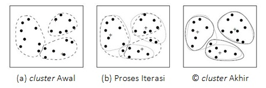
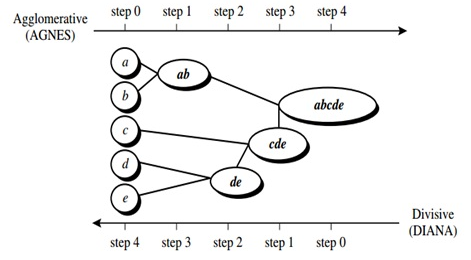
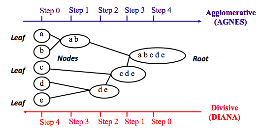
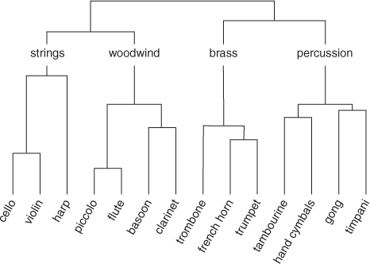

<style>

body {
text-align: justify}

</style>

```{r setup, include=FALSE}
knitr::opts_chunk$set(echo = TRUE, 
                      warning = FALSE, 
                      message = FALSE, 
                      fig.align = "center")
options(scipen = 99)

library(dplyr)
```

Clustering merupakan salah satu metode Unsupervised Learning yang bertujuan untuk melakukan pengelompokan data berdasasrkan kemiripan/jarak antar data. Clustering memiliki karakteristik dimana anggota dalam satu cluster memiliki kemiripan yang sama atau jarak yang sangat dekat, sementara anggota antar cluster memiliki kemiripan yang sangat berbeda atau jarak yang sangat jauh. Menurut (Tan et al., 2006) dalam bukunya yang berjudul *Introduction to Data Mining*, metode clustering dibagi menjadi dua jenis, yaitu Hierarchical Clustering dan Partitional Clustering[^1]. 

**Partitional Clustering** umumnya bertujuan untuk mengelompokkan data menjadi beberapa cluster yang lebih kecil[^2]. Pada prosesnya, setiap cluster akan memiliki titik pusat cluster (centroid) dan mencoba menghitung setiap data yang paling dekat dengan centroid tersebut. Metode dalam partitional clustering diantaranya k-means, fuzzy k-means, dan mixture modelling.

```{r, out.width = "80%", echo = FALSE, fig.align = "center"}

```

Sedangkan dalam **Hierarchical Clustering**, pengelompokan data dilakukan dengan membuat suatu bagan hirarki (**dendrogram**) dengan tujuan menunjukkan kemiripan antar data[^2]. Setiap data yang mirip akan memiliki hubungan hirarki yang dekat dan menbentuk cluster data. Bagan hirarki akan terus terbentuk hingga seluruh data terhubung dalam bagan hirarki tersebut. Cluster dapat dihasilkan dengan memotong bagan hirarki pada level tertentu. Beberapa metode dalam hierarchical clustering yaitu single linkage, complete linkage, average linkage, dan ward's minimum variance.

```{r, out.width = "80%", echo = FALSE, fig.align = "center"}

```

Pada kesempatan kali ini kita akan mendalami terkait Hierarchical Clustering serta aplikasinya untuk pengolahan data.

# Hierarchical Clustering

## Approach

Secara umum, hierarchical clustering dibagi menjadi dua jenis yaitu **agglomerative** dan **divisive**[^3]. Kedua metode ini dibedakan berdasarkan pendekatan dalam melakukan pengelompokkan data hingga membentuk dendrogram, menggunakan bottom-up atau top-down manner.

1. **Agglomerative Clustering** 

Agglomerative clustering biasa disebut juga sebagai agglomerative nesting (**AGNES**) dimana cara kerja dalam melakukan pengelompokan data menggunakan **bottom-up manner**. Prosesnya dimulai dengan menganggap setiap data sebagai 1 cluster kecil (leaf) yang hanya memiliki 1 anggota saja, lalu pada tahap selanjutnya dua cluster yang memiliki kemiripan akan dikelompokkan menjadi 1 cluster yang lebih besar (nodes). Proses ini akan dilakukan terus menerus hingga semua data menjadi satu cluster besar (root). 

2. **Divisive hierarchical clustering**

Divisive hierarchical clustering biasa disebut juga sebagai divisive analysis (**DIANA**) dimana cara kerja dalam melakukan pengelompokan data menggunakan **top-down manner**. Prosesnya dimulai dengan menganggap satu set data sebagai satu cluster besar (root), lalu dalam setiap iterasinya setiap data yang memiliki karakteristik yang berbeda akan dipecah menjadi 2 cluster yang lebih kecil (nodes) dan proses akan terus berjalan hingga setiap data menjadi 1 cluster kecil (leaf) yang hanya memiliki 1 anggota saja.

Berikut adalah illustrasi mengenai bagaimana agglomerative dan divisive clustering bekerja.

```{r, out.width = "80%", echo = FALSE, fig.align = "center"}

```

Selain memahami pendekatan dalam pembuatan dendrogram, mari memahami bagaimana setiap cluster dapat dibuat dan digabungkan.

## (Dis)similarity Measure

Tujuan dari clustering secara umum, baik hierarchical maupun partitional clustering adalah untuk membuat cluster yang memiliki karakteristik yang sama dalam satu anggota cluster dan memiliki karakteristik yang berbeda antar clusternya. Konsep inilah yang mengharuskan proses pembuatan cluster memperhatikan jarak / **(dis)similarity** / ukuran ketidakmiripan antar data. 

Terdapat beragam metode penghitungan (dis)similarity. Pemilihan metode (dis)similarity akan menentukan bagaimana kemiripan antar data dihitung. Itulah mengapa pemilihan metode (dis)similarity menjadi salah satu hal penting dalam pembuatan hierarchical clustering. 

Metode penghitungan (dis)similarity yang sering digunakan adalah *euclidean distance* dan *manhattan distance*, namun bisa saja menggunakan pengukuran jarak yang lain, bergantung pada data yang sedang kita analisis[^3]. Berikut ini formula dalam perhitungan (dis)similarity dari kedua metode tersebut:

1. **Euclidean distance**

$$d_{xy} = \sqrt {\sum_{i=1}^{n}(x_i - y_i)^2}$$

2. **Manhattan distance**

$$d_{xy} = \sum_{i=1}^{n} |{(x_i - y_i)}|$$

Ada beberapa pengukuran (dis)similarity yang lain yang bisa digunakan yaitu menggunakan **correlation-based distance**. Correlation-based distance biasa digunakan ketika kita ingin mengetahui bentuk (dis)similarity pada suatu data yang bergerak "naik" atau "turun" secara bersamaan. Pengukuran (dis)similarity ini sering digunakan untuk melakukan analisis ekspresi gen atau dalam dunia marketing, ketika kita ingin melakukan customer segmentation berdasarkan kesamaan barang yang dibeli oleh pelanggan tanpa memperhatikan banyak barang yang mereka beli.

Euclidean distance dan manhattan distance cenderung memiliki konsep yang berkebalikan dengan correlation-based distance, data yang akan dikelompokkan bersama merupakan data yang memiliki karakteristik nilai yang sama, entah sama besarnya atau sama kecilnya. Pengukuran ini biasa digunakan pada kasus customer segmentation yang memperhatikan banyaknya pembelian dari pelanggan, segmentasi daerah yang memiliki kasus COVID tinggi/rendah, dan lain sebagainya[^4]. 

Pada R, kita dapat menggunakan fungsi `dist()` untuk menghitung (dis)similarity antar data. Secara default, fungsi `dist()` akan menghitung *euclidean distance* antar data. 

Selanjutnya, nilai (dis)similarity antar data ini akan dibentuk menjadi **distance matrix**. Kemudian, distance matrix tersebut akan diolah untuk penyusunan dendrogram.

## Linkage Method

Dalam hierarchical clustering, selain menghitung (dis)similarity antar data, diperlukan juga cara untuk menghitung (dis)similarity antar cluster sehingga dapat terbentuk dendrogram dari cluster-cluster yang dekat. Proses penggabungan cluster-cluster kecil menjadi satu dendrogram utuh dilakukan melalui beberapa pendekatan **Linkage Method**. Berikut ini linkage method yang sering digunakan pada agglomerative approach:

1. **Complete Linkage** / **Maximum Linkage**
2. **Single Linkage** / **Minimum Linkage**
3. **Average Linkage**
4. **Centroid Linkage**
5. **Ward's minimum Variance**

### Complete/Maximum Linkage

Pengukuran (dis)similarity atau jarak antar cluster dilakukan dengan mengukur terlebih dahulu jarak antar tiap observasi dari cluster yang berbeda (**pairwise distances**). Jarak paling tinggi (maximum distance) akan menjadi ukuran (dis)similarity antar cluster. Kemudian, dendrogram akan terbentuk dari cluster-cluster yang memiliki (dis)similarity paling kecil. Hal ini membuat dendrogram yang terbentuk menjadi lebih terpisah antar clusternya (terbentuk cluster yang "compact").

Berikut formula jarak antar cluster menggunakan complete linkage:

$$d_{12} = \max_{ij} d(X_i, Y_j)$$

di mana:

* $X_1, X_2, ..., X_k$ : observasi pada cluster 1
* $Y_1, Y_2, ..., Y_k$ : observasi pada cluster 2
* $d(X, Y)$ : jarak antara data pada cluster 1 dengan data pada cluster 2

### Single/Minimum Linkage

Pengukuran (dis)similarity atau jarak antar cluster dilakukan dengan mengukur terlebih dahulu jarak antar tiap observasi dari cluster yang berbeda pairwise distances. Jarak paling kecil (minimum distance) akan menjadi ukuran (dis)similarity antar cluster. Dendrogram akan terbentuk dari cluster-cluster yang memiliki (dis)similarity paling kecil. Hal ini membuat dendrogram yang terbentuk menjadi lebih "loose" atau berdekatan antar clusternya.

Berikut formula jarak antar cluster menggunakan single linkage:

$$d_{12} = \min_{ij} d(X_i, Y_j)$$

### Average Linkage

Pengukuran (dis)similarity atau jarak antar cluster dilakukan dengan mengukur terlebih dahulu jarak antar tiap observasi dari cluster yang berbeda pairwise distances. Kemudian, dihitung rata-rata jarak dari pairwise distance tersebut dan nilai tersebut akan menjadi ukuran (dis)similarity antar cluster. Dendrogram akan terbentuk dari cluster-cluster yang memiliki (dis)similarity paling kecil. Umumnya metode ini akan menghasilkan cluster yang tidak terlalu "loose" maupun "compact".

Berikut formula jarak antar cluster menggunakan average linkage:

$$d_{12} = \frac{1}{kl} \sum_{i=1}^{k}\sum_{j=1}^{l} d(X_i, Y_j)$$

### Centroid Linkage

Perhitungan (dis)similarity atau jarak antar cluster dilakukan dengan mengukur jarak antar centroid pada dua cluster. Perhitungan centroid disini menggunakan rata-rata pada suatu variabel x. Dendrogram yang terbentuk akan berdasarkan cluster dengan jarak antar centroid paling kecil.

Berikut formula jarak antar cluster menggunakan centroid linkage:

$$d_{12} = d(\bar X, \bar Y)$$

### Ward's Minimum Variance

Pada metode ini, di tiap iterasinya akan dibentuk cluster-cluster yang kemudian dihitung nilai within sum of square tiap cluster (WSS). WSS dapat diartikan sebagai jumlah dari jarak tiap observasi ke nilai tengah cluster. Cluster-cluster yang menghasilkan within sum of square terkecil akan diambil kemudian digabungkan hingga membentuk satu dendrogram utuh.

Berikut adalah ilustrasi untuk kelima jenis linkage di atas[^5]:

```{r, out.width = "80%", echo = FALSE, fig.align = "center"}
knitr::include_graphics("image/linkage.png")
```

Linkage method akan menentukan rupa dari dendrogram yang terbentuk. Telah dilakukan diskusi terkait beragam linkage method dan pemilihannya [disini](https://stats.stackexchange.com/questions/195446/choosing-the-right-linkage-method-for-hierarchical-clustering)

## Dendrogram Interpretation

Setelah menghasilkan dendrogram dari hierarchical clustering, sudah sepatutnya kita perlu mampu membaca dendrogram tersebut. Sebagai contoh, berikut adalah gambar kedekatan beberapa instrumen musik yang digambarkan dengan dendrogram:

```{r, out.width = "80%", echo = FALSE, fig.align = "center"}

```

Dendrogram sejatinya merupakan struktur yang menggambarkan kemiripan antar data. Tiap data pada awalnya diletakan di suatu level dasar dimana tiap data berdiri sendiri sebagai satu cluster tunggal. Pada contoh di atas, tiap instrumen musik merupakan 1 cluster tunggal di bagian dasar dendrogram. 

Kemudian, data-data terdekat akan digabungkan menjadi 1 cluster dan dihubungkan dengan suatu garis. Contohnya cluster instrumen "piccolo" & "flute" dan cluster instrumen "basoon" & "clarinet". Garis tersebut dimulai dari titik data dan bersatu di titik tertentu. 

**Panjang garis antar data (dihitung tegak lurus dari titik data hingga titik kedua garis bersatu) mewakilkan nilai (dis)similarity antar data**. Disini kita bisa menyimpulkan bahwa "piccolo" dengan "flute" memiliki kedekatan yang lebih tinggi dibandingkan "basoon" dengan "clarinet". Kita juga bisa mengetahui bahwa "flute" memiliki kedekatan yang lebih tinggi dengan "clarinet" dibandingkan dengan "trumpet". Hal ini karena "flute" dan "clarinet" memiliki panjang garis antar data yang lebih pendek dibandingkan antara "flute" dan "trumpet".

Pada partitional clustering yang mungkin lebih umum kita kenal (contohnya k-means), pengguna perlu menentukan jumlah `k` cluster yang ingin dibentuk. Namun, pada hierarchical clustering hal tersebut tidak diwajibkan[^2]. Hal ini berangkat dari tujuan awal hierarchical clustering yang fokus pada mengetahui kedekatan antar data (bukan mengetahui partisi antar data).

Meskipun begitu, **kita tetap dapat membuat cluster-cluster data dengan memotong dendrogram pada nilai (dis)similarity tertentu**. Pada contoh dendrogram di atas, kita membuat partisi berupa cluster "strings", "woodwind", "brass", dan "percussion".

Layaknya menentukan kedekatan antar data, kita juga dapat menetukan kedekatan antar cluster dengan memperhitungkan panjang garis antar data. Dari dendrogram di atas, kita dapat menarik insight bahwa cluster "woodwind" lebih dekat dengan cluster "strings" dibandingkan dengan cluster "brass" dan "percussion".

Bila disimpulkan, **semakin panjang garis antar data maka semakin berbeda antar data/cluster tersebut, dan semakin pendek garis antar data maka semakin mirip antar data/cluster tersebut**. Dari pemahaman ini, kita juga bisa menentukan manakah data yang berdekatan/berjauhan dengan data yang sedang kita analisis.

Hal lain yang dapat diperhatikan dalam analisis cluster adalah adanya kemungkinan untuk memperoleh cluster yang hanya terdiri dari satu atau sedikit sekali anggota. Ketika hal tersebut terjadi, kita perlu melakukan pengecekan kembali pada data yang kita miliki. Hal ini bisa disebabkan karena adanya data yang cukup berbeda dengan yang lainnya atau biasa disebut **outlier / anomali**. 

## Flow of Analysis

Secara umum, berikut adalah langkah-langkah yang dilakukan untuk melakukan hierarchical cluster analysis, menggabungkan konsep-konsep yang sudah kita pahami sebelumnya:

1. Menyiapkan data dimana data yang digunakan adalah data bertipe numerik agar dapat digunakan untuk penghitungan jarak.
2. Menghitung (dis)similarity atau jarak antar data yang berpasangan pada dataset. Metode penghitungan (dis)similarity dapat dipilih berdasarkan data. Nilai (dis)similarity tersebut kemudian akan disusun menjadi distance matrix.
3. Membuat dendrogram dari distance matrix menggunakan linkage method tertentu. Kita juga dapat mencoba beberapa linkage method kemudian memilih dedrogram paling baik.
4. Menentukan dimana akan melakukan pemotongan tree (dengan nilai (dis)similarity tertentu). Disinilah tahap dimana cluster akan terbentuk.
5. Melakukan interpretasi dari dendrogram yang telah didapat.

## Pros & Cons

Berikut adalah beberapa kelebihan dan kekurangan hierarchical clustering yang juga dapat dipertimbangkan sebelum dipakai untuk analisis data.

**Kelebihan:**

* Mampu menggambarkan kedekatan antar data dengan dendrogram.
* Cukup mudah untuk pembuatannya.
* Dapat menentukan banyak cluster yang terbentuk setelah dendrogram terbentuk.

**Kekurangan:**

* Tidak dapat menganalisis data kategorik secara langsung (terhambat pada penghitungan jarak yang hanya bisa dilakukan untuk data numerik, sehingga data kategorik perlu dipre-process terlebih dahulu).
* Tidak diperuntukkan untuk menghasilkan jumlah cluster optimal yang mutlak (jumlah cluster dapat berubah-ubah tergantung level pemotongan dendrogram).
* Sensitif terhadap data yang memiliki skala berbeda (sehingga data perlu dinormalisasi/standarisasi terlebih dahulu).
* Sensitif terhadap outlier.
* Cukup berat komputasinya untuk data berukuran besar.

# Hierarchical Clustering Application

Hierarchical Clustering memiliki keunggulan yang tidak dimiliki oleh metode clustering lain, yaitu dapat merepresentasikan kedekatan antar tiap data dengan dendrogramnya. Hal ini amat bermanfaat khususnya dalam **analisis network/komunitas** atau deteksi data dari suatu komunitas. Oleh karena itu hierarchical clustering banyak dilakukan pada kasus-kasus berikut:

1. [Social Network Community Detection](https://www.hindawi.com/journals/complexity/2017/3719428/)
2. [Analisis Evolusi Mahluk Hidup - Biodiversity of Butterflies](https://www.floridamuseum.ufl.edu/science/at-last-butterflies-get-a-bigger-better-evolutionary-tree/)
3. [Analisis Penyebaran Penyakit - Nextrain for COVID19 Tracking](https://academic.oup.com/bioinformatics/article/34/23/4121/5001388)

# Study Case

[^1]: Tan, P.N., Steinbach, M., Kumar, V. (2006) Introduction to Data Mining. Boston: Pearson Education.

[^2]: Fred, A.L.N. dan Leitao, J.M.N. (2000) Partitional vs Hierarchical Clustering Using a Minimum Grammar Complexity Approach, di F.J. Ferri et al. (Eds.): SSPR&SPR 2000, LNCS 1876, hal. 193-202. Berlin: Springer-Verlag

[^3]: University of Cincinnati Business Analytics. UC Business Analytics R Programming Guide, Bab [Hierarchical Clustering](https://uc-r.github.io/hc_clustering)

[^4]: [(Dis)similarity Measure](https://www.datanovia.com/en/lessons/clustering-distance-measures/)

[^5]: Rhys, H.I. (2020) [Machine Learning with R, the tidyverse, and mlr](https://livebook.manning.com/book/machine-learning-for-mortals-mere-and-otherwise/chapter-17/). USA: Manning Publications Co.